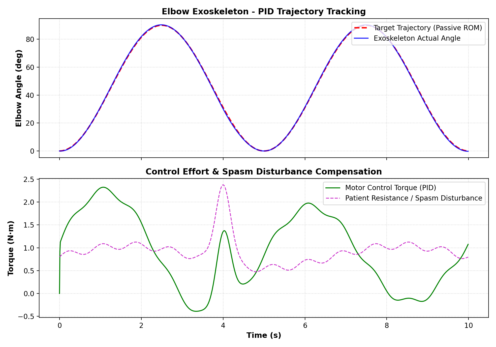
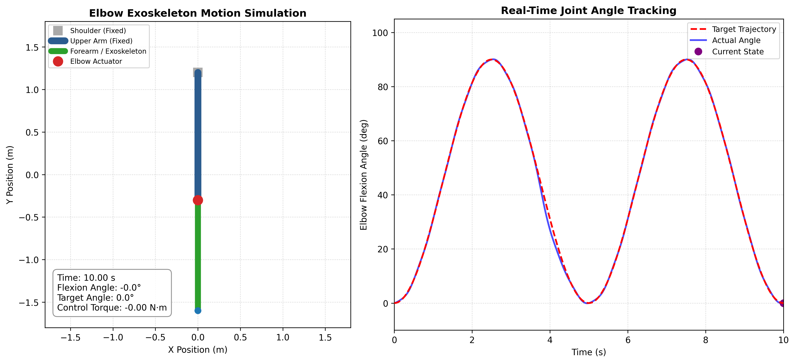

# Rehabilitation Elbow Exoskeleton Control

A simulation-based control and biomechanical modeling project focused on a 1-DOF robotic elbow exoskeleton for physical rehabilitation and motor recovery. This project implements a full simulation pipeline—from trajectory generation and muscular spasm modeling to closed-loop PID control and kinematic visualization.

## Features
- **Biomechanical Trajectory Generation:** Generates smooth, physiological elbow flexion-extension reference trajectories ($\theta_d \in [0^\circ, 90^\circ]$).
- **Spasticity & Disturbance Modeling:** Simulates involuntary muscle resistance and pathological spasm disturbances using harmonic torque profiles and stochastic perturbations.
- **Closed-Loop Control Architecture:** Implements a discrete PID controller with integral anti-windup and actuator torque saturation for patient safety.
- **Dynamic Joint Simulation:** Models elbow joint dynamics and passive mechanical impedance to evaluate tracking fidelity under external disturbances.
- **Kinematic Visualization & Animation:** Provides 2D anatomical stick-figure animation and real-time synchronized tracking error telemetry.
- **Performance Evaluation:** Computes quantitative control metrics including Mean Absolute Error (MAE) and Root Mean Square Error (RMSE).

## Project Structure
- `src/`: Source code for the simulation and control pipeline.
  - `simulate_data.py`: Generates reference rehabilitation trajectories and muscular resistance datasets.
  - `pid_controller.py`: Implements the PID controller and runs dynamic response simulations.
  - `elbow_animation.py`: Provides 2D kinematic joint animation and real-time tracking visualization.
- `figures/`: Generated plots, control response figures, and visualizer screenshots.
- `data/`: Simulation datasets and trajectory logs.
  - `rehabilitation_simulation_data.csv`: Logged trajectory and resistance torque values.

## Requirements
To install the necessary dependencies, run:
```bash
pip install -r requirements.txt
```

## Usage
1. Generate Rehabilitation Data:
```bash
python src/simulate_data.py
```

2. Run Closed-Loop PID Simulation:
```bash
python src/pid_controller.py
```

3. Launch Kinematic Animation Visualizer:
```bash
python src/elbow_animation.py
```

## Results & Visualizations
### 1. Control Tracking & Disturbance Rejection
The PID controller tracks the desired rehabilitation trajectory while compensating for external muscle resistance and spastic torque spikes:

### 2. Kinematic Motion Simulation
A 2D kinematic representation of the upper arm and forearm segments during active-assisted elbow flexion-extension:


## Technical Overview
- PID Control Law:
$$
\tau(t) = K_p e(t) + K_i \int_0^t e(\tau) d\tau + K_d \frac{de(t)}{dt}
$$
- ​Anti-Windup & Saturation: Torque limits are enforced to guarantee user safety within typical physiological thresholds.
- Kinematic Model:
    - Segment 1 (Upper Arm): Fixed reference segment.
    - Segment 2 (Forearm): Rotates around the elbow joint center within anatomical range.

## How to Reproduce
1. Clone the repository:
```bash
git clone https://github.com/amirasadilamouki/Rehabilitation-Elbow-Exoskeleton-Control
```

2. Set up the virtual environment:
```bash
   python -m venv .venv
   .\.venv\Scripts\activate
```
   
3. Install requirements and run the scripts in the src/ directory.

## Future Work
- Implementation of adaptive and sliding mode control (SMC) for high-frequency spasm compensation.
- Integration of surface electromyography (sEMG) signals for intention-driven control.
- Hardware-in-the-loop (HIL) testing with physical robotic actuators.

## Project Context
Developed as part of a Biomedical Engineering portfolio project, focusing on Rehabilitation Robotics and Control Systems.

